# DevOps Final Project

## Project Overview

Projek ini menunjukkan implementasi DevOps environment menggunakan AWS, Terraform, Ansible, Docker, Amazon ECR, Prometheus dan Grafana.

Aplikasi dibina sebagai Docker image dan disimpan dalam Amazon ECR. Deployment aplikasi dan monitoring infrastructure dikonfigurasi menggunakan Ansible.

---

# 1. Project Overview

## Objective

Objektif projek ini adalah untuk membina dan menguruskan infrastructure, application dan monitoring menggunakan DevOps tools dan automation.

## Technologies Used

- AWS EC2
- AWS VPC
- Internet Gateway
- NAT Gateway
- Security Group
- Terraform
- Ansible
- Docker
- Amazon ECR
- GitHub Actions
- Prometheus
- Grafana

---

# 2. System Architecture

Bahagian ini menerangkan architecture keseluruhan sistem berdasarkan infrastructure yang telah dibina.

System architecture diagram akan ditambah berdasarkan evidence sebenar.

---

# 3. Infrastructure

Infrastructure projek dibina menggunakan AWS dan diuruskan menggunakan Terraform sebagai Infrastructure as Code.

AWS infrastructure menggunakan sebuah VPC dengan public dan private subnet untuk memisahkan public application access dan private infrastructure resources.

---

## VPC

VPC digunakan sebagai network utama untuk keseluruhan infrastructure.

| Configuration | Value |
|---|---|
| VPC ID | `vpc-05850111c1dbc50ed` |
| CIDR Block | `10.0.0.0/24` |
| State | `available` |
| Region | `ap-southeast-1` |

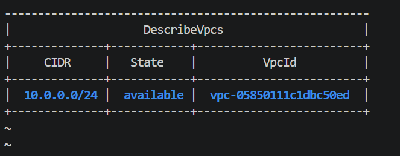

---

## Subnets

Infrastructure menggunakan dua subnet dalam Availability Zone `ap-southeast-1a`.

| Subnet Type | CIDR Block | Availability Zone | Public IP on Launch |
|---|---|---|---|
| Public Subnet | `10.0.0.0/25` | `ap-southeast-1a` | `True` |
| Private Subnet | `10.0.0.128/25` | `ap-southeast-1a` | `False` |

Public Subnet digunakan untuk resources yang memerlukan internet access secara langsung.

Private Subnet digunakan untuk internal infrastructure yang tidak menerima inbound connection secara langsung daripada Internet.

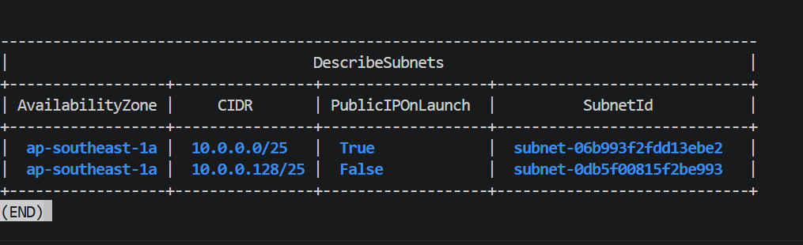

---

## Route Tables

Public dan Private Subnet menggunakan route table yang berbeza.

Public Subnet mempunyai default route ke Internet Gateway untuk membolehkan resources dalam Public Subnet berkomunikasi dengan Internet.

Private Subnet mempunyai default route ke NAT Gateway untuk membolehkan resources dalam Private Subnet membuat outbound connection ke Internet tanpa menerima inbound connection secara langsung.

### Public Route

    10.0.0.0/24 → local
    0.0.0.0/0  → Internet Gateway

### Private Route

    10.0.0.0/24 → local
    0.0.0.0/0  → NAT Gateway

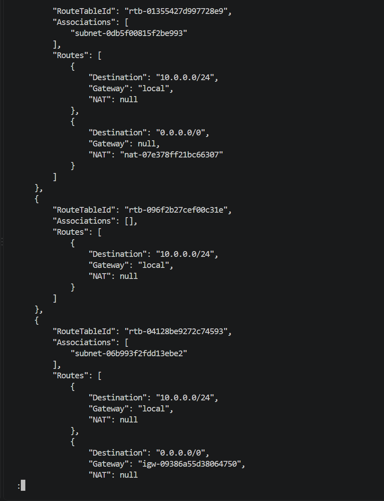

---

## Internet Gateway and NAT Gateway

Internet Gateway digunakan untuk menyediakan Internet connectivity kepada resources dalam Public Subnet.

NAT Gateway digunakan oleh resources dalam Private Subnet untuk membuat outbound connection ke Internet tanpa menerima inbound connection secara langsung.

### Internet Gateway

| Configuration | Value |
|---|---|
| Internet Gateway ID | `igw-09386a55d38064750` |
| VPC ID | `vpc-05850111c1dbc50ed` |
| State | `available` |

### NAT Gateway

| Configuration | Value |
|---|---|
| NAT Gateway ID | `nat-07e378ff21bc66307` |
| Private IP | `10.0.0.27` |
| Public IP | `54.254.94.91` |
| Subnet ID | `subnet-06b993f2fdd13ebe2` |
| State | `available` |

NAT Gateway ditempatkan dalam Public Subnet dan digunakan sebagai outbound Internet access untuk resources dalam Private Subnet.

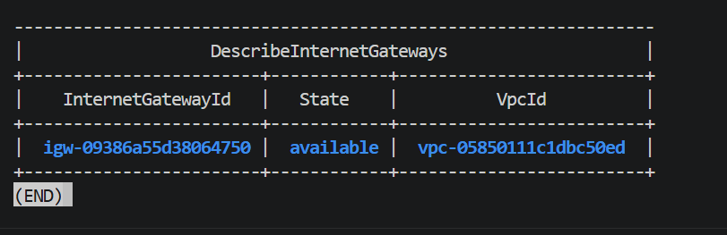

---

## EC2 Instances

Infrastructure menggunakan tiga EC2 instances dengan peranan yang berbeza.

| Instance | Private IP | Public IP | Subnet | Role |
|---|---|---|---|---|
| Web Server | `10.0.0.5` | `52.77.41.110` | Public Subnet | Application Server |
| Ansible Controller | `10.0.0.135` | None | Private Subnet | Configuration Management |
| Monitoring Server | `10.0.0.136` | None | Private Subnet | Prometheus and Grafana |

### Web Server

Web Server ditempatkan dalam Public Subnet.

Server ini digunakan untuk menjalankan application container dan menerima public application traffic.

### Ansible Controller

Ansible Controller ditempatkan dalam Private Subnet.

Server ini digunakan untuk menjalankan automation dan configuration management menggunakan Ansible.

### Monitoring Server

Monitoring Server ditempatkan dalam Private Subnet.

Server ini digunakan untuk menjalankan Prometheus dan Grafana.

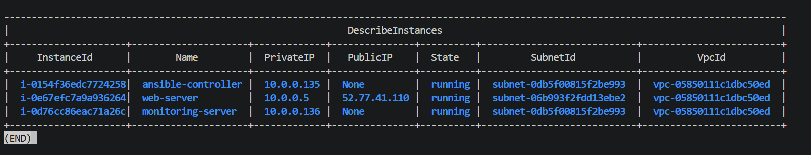

---

# 4. Security

AWS Security Groups digunakan untuk mengawal inbound dan outbound network traffic bagi infrastructure.

Infrastructure ini menggunakan dua Security Groups:

- `devops-public-sg`
- `devops-private-sg`

## Security Groups

Public dan private resources menggunakan Security Groups yang berbeza berdasarkan fungsi masing-masing.

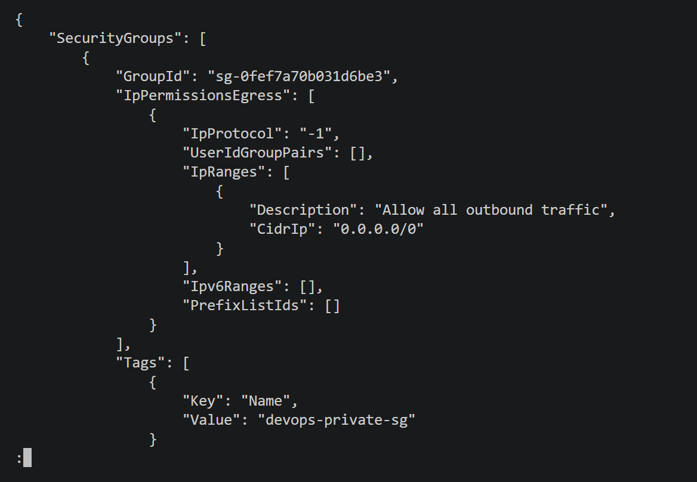

---

## Public Security Group

Security Group `devops-public-sg` digunakan untuk Web Server yang berada dalam Public Subnet.

Security rules yang dikonfigurasi adalah:

| Protocol | Port | Source | Description |
|---|---:|---|---|
| TCP | `22` | `10.0.0.0/24` | Allow SSH from VPC |
| TCP | `80` | `0.0.0.0/0` | Allow HTTP from Internet |
| TCP | `9100` | `10.0.0.136/32` | Allow Node Exporter from Monitoring Server only |
| All | All | `0.0.0.0/0` | Allow all outbound traffic |

Port `22` membolehkan SSH access daripada network VPC.

Port `80` membolehkan application di Web Server diakses dari Internet.

Port `9100` digunakan oleh Node Exporter. Access kepada port ini dihadkan kepada Monitoring Server dengan IP `10.0.0.136`.

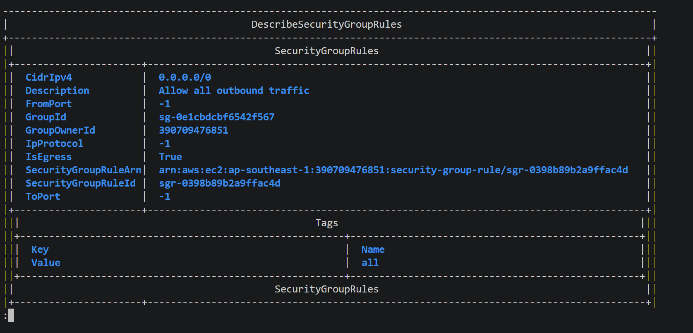

---

## Private Security Group

Security Group `devops-private-sg` digunakan untuk resources yang berada dalam Private Subnet.

Security rules yang dikonfigurasi adalah:

| Protocol | Port | Source | Description |
|---|---:|---|---|
| TCP | `22` | `10.0.0.0/24` | Allow SSH from VPC |
| All | All | `0.0.0.0/0` | Allow all outbound traffic |

Private servers tidak menerima HTTP traffic secara langsung daripada Internet.

SSH access hanya dibenarkan daripada VPC network `10.0.0.0/24`.

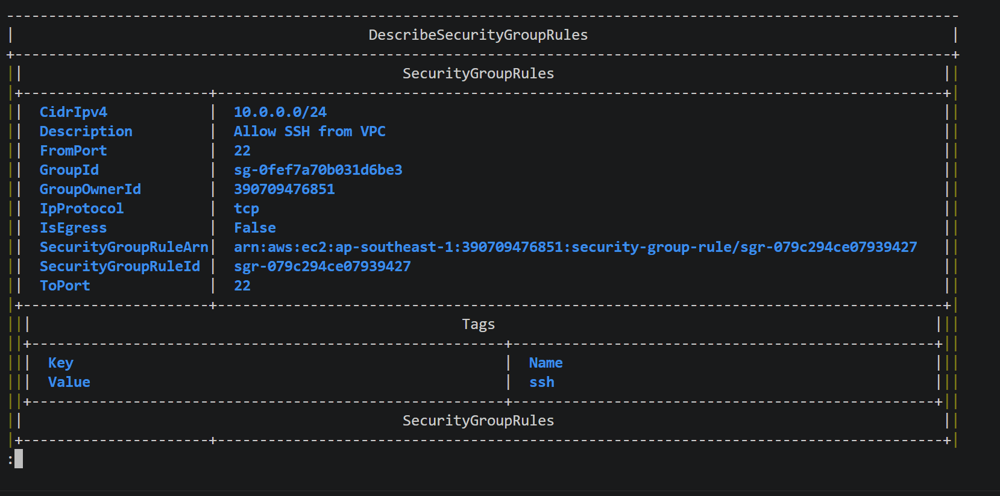

---

# 5. Application

Application dibina sebagai containerized web application menggunakan Docker.

Application dibina menggunakan multi-stage Docker build dan production container menggunakan Nginx.

## Docker Build

Dockerfile menggunakan dua build stages.

Stage pertama menggunakan:

`node:20-alpine`

Stage ini digunakan untuk:

1. Install application dependencies menggunakan `npm ci`
2. Run application tests menggunakan `npm test`
3. Build application menggunakan `npm run build`

Build output kemudiannya dihasilkan dalam directory:

`/app/dist`

Stage kedua menggunakan:

`nginx:alpine`

Static application files daripada build stage disalin ke:

`/usr/share/nginx/html`

Container expose port:

`80`

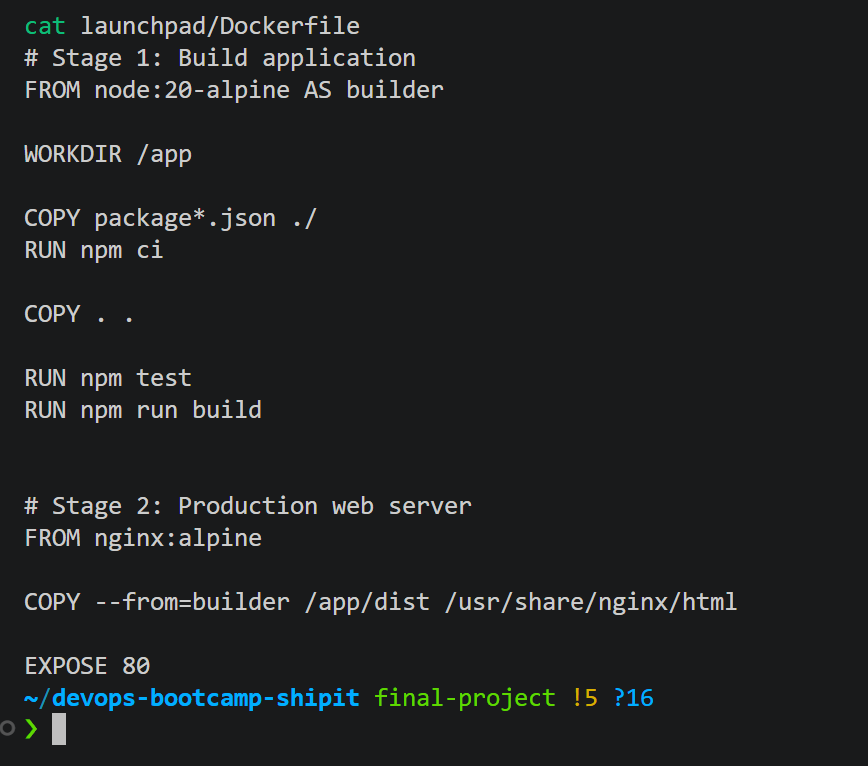

---

## Application Container

Application dijalankan pada Web Server sebagai Docker container.

| Configuration | Value |
|---|---|
| Container Name | `devops-nginx` |
| Application Image | `390709476851.dkr.ecr.ap-southeast-1.amazonaws.com/mazrolmali:latest` |
| Container Status | `Up` |
| Host Port | `80` |
| Container Port | `80` |

Docker container menggunakan application image daripada Amazon ECR.

Port mapping menunjukkan bahawa HTTP traffic pada Web Server port `80` dihantar kepada application container.

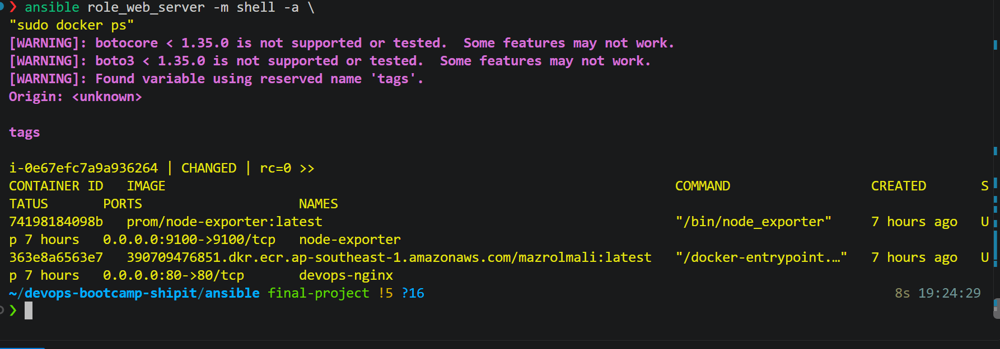

---

## Application HTTP Verification

Application telah diverifikasi menggunakan HTTP request dari Web Server.

Command yang digunakan:

```text
curl -I http://localhost
```

Application memberikan HTTP response:

```text
HTTP/1.1 200 OK
```

Response ini mengesahkan bahawa application container sedang berjalan dan Nginx berjaya memberikan HTTP response pada port `80`.

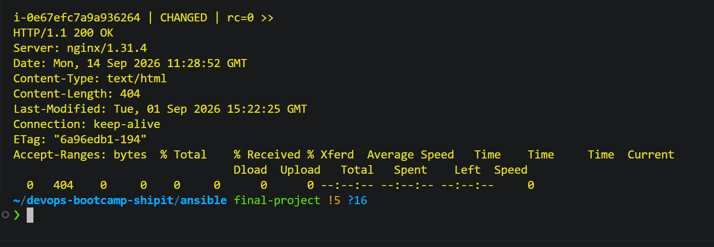

---

# 6. CI/CD Pipeline

## Overview

CI/CD dalam projek ini menggunakan GitHub Actions untuk mengautomasikan proses Continuous Integration dan Continuous Delivery bagi application.

GitHub Actions workflow digunakan untuk menjalankan proses berikut secara automatik:

1. Checkout source code daripada GitHub repository
2. Setup Node.js environment
3. Install application dependencies
4. Build application
5. Run application tests dan pre-flight validation
6. Upload production build sebagai GitHub Pages artifact
7. Deploy application menggunakan GitHub Pages

Workflow CI/CD dikonfigurasi dalam repository pada lokasi:

```text
.github/workflows/deploy.yml

---

# 7. Deployment

Deployment application menggunakan:

- Amazon ECR
- Docker
- Ansible

Application Docker image dibina dan disimpan dalam Amazon ECR. Ansible digunakan untuk mengkonfigurasi web server, melakukan login ke Amazon ECR, pull application image dan menjalankan application container.

---

## Deployment Automation

Web server dikonfigurasi menggunakan Ansible dengan roles berikut:

- `common`
- `docker`
- `app`
- `node_exporter`

Deployment dilakukan menggunakan:

```bash
ansible-playbook site.yml --limit role_web_server

---

## Amazon ECR

Docker image application disimpan dalam Amazon ECR.

Ansible menggunakan AWS CLI untuk mendapatkan authentication token dan melakukan login ke ECR.

```text
aws ecr get-login-password --region ap-southeast-1

---

# 8. Monitoring

Monitoring infrastructure menggunakan:

- Prometheus
- Node Exporter
- Grafana

Prometheus mengambil metrics daripada Node Exporter pada Web Server.

Grafana digunakan untuk visualisation monitoring data.

---

# 9. Automation

Automation dalam projek ini menggunakan:

- Terraform untuk Infrastructure as Code
- Ansible untuk Configuration Management dan deployment
- GitHub Actions untuk CI/CD workflow

---

# 10. Verification

Verification dilakukan untuk memastikan komponen sistem berfungsi.

Evidence verification termasuk:

- Ansible connectivity
- Docker containers
- Application container status
- Amazon ECR image digest
- Prometheus target health
- Grafana health
- Grafana Prometheus datasource

---

# URLs

## Application URL

`ADD_APPLICATION_URL_HERE`

## Monitoring URL

`ADD_MONITORING_URL_HERE`

## Repository URL

https://github.com/azrolal/devops-bootcamp-shipit
